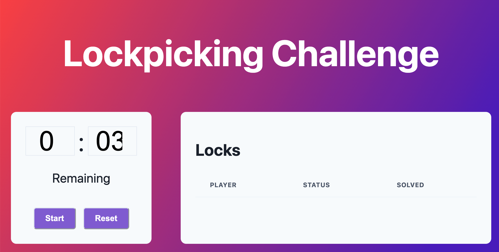

# Lockpicking Challenge

Welcome to the Lockpicking challenge.  This game consists of three parts:
1. A physical set of boards with a mounted deadbolt.
2. A backend that talks to the boards.
3. A frontend UI that runs the contest.

## Setup

You will need to have node.js installed on your computer. All development was done
with node.js 20.0.8, so we suggest that version.  You can install node.js from [here](https://nodejs.org/en/download). 

1. Plug in the cord running from the lock board to the circuit board
   connectors, starting at JST connector 2. 
   * The circuit board JST connectors are labeled 2 through n because JST
     connector 2 corresponds to PIN 2 on the arduino.  These do *not* need to
     match the lock number, and are labeled for internal debugging.
2. Plug in the circuit board USB-A to your computer. This will create a USB
   modem device. To find the device, type `ls /dev/cu.usb*` and note the full
   path. You will need this in the next step. 
3. `npm i` to install all dependencies.
4. edit `backend/src/server.ts` line 43 to have the correct device from step 2
   above. For example, on my computer it is `/dev/cu.usbmodem1101`.  If you
   switch the USB dongle to different ports on your computer this number will
   change.
5. In terminal window 1, run `npm run backend`
6. In terminal window 2, run `npm run frontend`
7. Navigate to the localhost path printed above, e.g., `http://localhost:5173`

# Running the game

You should be able to run everything from the frontend. 
* Set the maximum amount of time you want to give contestants in the input
  boxes.
* Press start to start a competition.
* Press reset to reset the timer and competition.

## Configuration

The code is very alpha, so consider the following some pointers:

* The number of locks to check is hardcoded in `server/server.ts` as `NUM_LOCKS`.  By
  default, it's 5.  It does not hurt to have this number larger than the number
  of boards you have; it just results in more being displayed in the frontend
  UI.
 